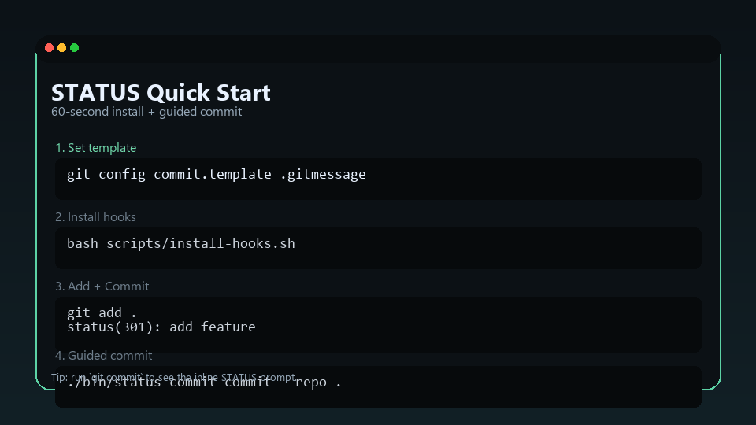
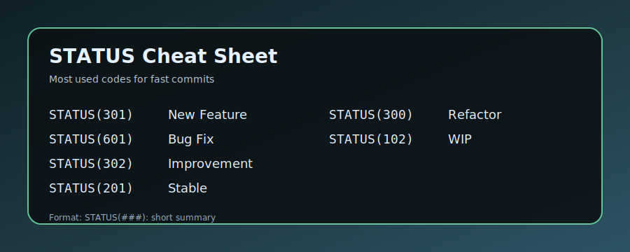

# STATUS Commit System
Readable git history, at a glance.

Created by Himeshchanchal Bhattarai
Inspired by HTTP status semantics.

[](LICENSE)
[](README.md)
[](https://github.com/Himesh-Bhattarai/STATUS_COMMIT/actions/workflows/status-commit.yml)

## What It Is
STATUS is a commit convention that encodes the reliability and state of a change.
It makes git history scannable, honest, and easy to communicate across teams.
The STATUS code signals the objective, intended state (working, broken, refactored, WIP), while the message remains the author's narrative about what they did and why.

## Why STATUS
- You can scan a log and immediately see what is stable, risky, or in progress.
- It reduces bikeshedding by limiting the code to a small, consistent set.
- It makes risk explicit (e.g., `409` for risky, `500` for broken) so teams don't ship surprises.

Example:
```
status(301): add export endpoint
status(409): works but risky, needs extra testing
```

## Quickstart (60 Seconds)
1. Install the npm CLI globally (published)  
   ```bash
   npm install -g status-commit
   ```
2. Install hooks into your repo (no manual templates needed)  
   ```bash
   status-commit install --ci --templates
   ```
3. Commit as usual  
   ```bash
   git commit -m "status(301): add export endpoint"
   ```
4. Inspect risk + drift (optional)  
   ```bash
   status-commit scan --limit 200
   status-commit report --limit 50
   status-commit dashboard --limit 200
   ```
Tip: run `git commit` (without `-m`) to see the inline STATUS prompt in your editor (prepare hook stays optional).

## Quick Start Video (GIF)
Below is a short, looping GIF showing the 60-second install and a guided commit.
Recorded with v1.3.0 (2026-02-27) using `status-commit install --ci --templates`.



## One-Command Install
With the npm CLI installed, drop into any repo and run:
```bash
status-commit install
```
This writes a `commit-msg` hook that enforces `status(###): ...` (codes unchanged).

## Validate a Commit Message
Useful in CI or before committing:
```bash
status-commit commit "status(301): add export endpoint"
```

## VS Code Extension
An extension source is included in `vscode-extension/`. It provides:
- Autocomplete for `status(###):` in commit message editors.
- A command: `STATUS Commit: Insert Code` (Quick Pick).

### Install Locally (VSIX)
```bash
cd vscode-extension
npm i -g @vscode/vsce
vsce package
code --install-extension status-commit-0.0.1.vsix
```

### Run In Dev Mode
Open the `vscode-extension` folder in VS Code and press `F5`.

## Format

```
status(###): short summary
```

Special case:

```
status(infinity): short summary
```

Accepted prefixes: `STATUS`, `Status`, `status` (recommended: `status`).
Required separator between code and summary: `:`.

## Cheat Sheet


Printable version:
[Printable Cheat Sheet (PNG)](assets/status-cheatsheet-printable.png)

Top codes:

| Code | When to use |
| --- | --- |
| STATUS(301) | New feature that works |
| STATUS(601) | Bug fix |
| STATUS(302) | Improvement to existing feature |
| STATUS(201) | Stable change |
| STATUS(300) | Refactor only |
| STATUS(102) | Work in progress |

## Decision Guide
- Use 1xx when the work is incomplete or experimental.
- Use 103 when the work is blocked or waiting on a dependency.
- Use 104 for research or spike work.
- Use 2xx when the change is working and safe.
- Use 3xx when you improved or refactored something.
- Use 5xx when something is broken or failing.
- Use 6xx when you fixed a failure.
- Use 203 for documentation-only changes.
- Use 409 when it works but is risky or fragile.
- Use 404 for human chaos or debugging madness.

## Full Code List
| Category | Code | Meaning |
| --- | --- | --- |
| Initialization | STATUS(001) | Initial commit / project start |
| Initialization | STATUS(002) | Base structure established |
| Initialization | STATUS(003) | Create / delete folder or file |
| In Progress | STATUS(101) | Draft or scaffolding added |
| In Progress | STATUS(102) | Partial implementation |
| In Progress | STATUS(103) | Blocked / waiting on dependency |
| In Progress | STATUS(104) | Research / spike / exploration |
| Stable / Working | STATUS(201) | Working as expected |
| Stable / Working | STATUS(202) | Verified with real usage |
| Stable / Working | STATUS(203) | Documentation updated (README, JSDoc, etc.) |
| Stable / Working | STATUS(204) | Production-ready |
| Change / Improvement | STATUS(300) | Refactoring (no functional change) |
| Change / Improvement | STATUS(301) | Feature or capability added |
| Change / Improvement | STATUS(302) | Enhancement or improvement |
| Design / Usage Issues | STATUS(401) | Incorrect data flow or usage |
| Design / Usage Issues | STATUS(403) | Scope or responsibility issue |
| Design / Usage Issues | STATUS(408) | Performance / latency issues identified |
| Design / Usage Issues | STATUS(409) | Works but risky / fragile (needs review or testing) |
| Broken / Failure | STATUS(500) | Not working / runtime failure |
| Broken / Failure | STATUS(502) | Interface or contract mismatch |
| Broken / Failure | STATUS(503) | Security vulnerability or auth failure |
| Recovery | STATUS(601) | Bug or failure fixed |
| Recovery | STATUS(603) | Structure or state corrected |
| Special | STATUS(infinity) | Gold Master / Fully stable, tested, and trusted |
| Special | STATUS(404) | Human State / Chaos (does not indicate code quality) |

Note: Some numeric gaps are intentional and reserved for future codes or team-specific use.

## Examples

```
status(301): add export endpoint
status(601): fix null pointer in auth middleware
status(102): scaffold payment flow
status(103): blocked by vendor API changes
status(409): works but risky, needs extra testing
status(203): update README and usage examples
status(infinity): v1.0.0 gold master
status(404): everything is broken except me
```

## Live Examples
- [STATUS Commit System (this repo) - commit history](https://github.com/Himesh-Bhattarai/STATUS_COMMIT/commits/main)

## Tooling In This Repo
- `status-commit/` npm CLI (bin: `status-commit`) with `install`, `scan`, `report`, `dashboard`.
- `hooks/commit-msg` enforced by the CLI installer (codes unchanged).
- `status-codes.json` provides machine-readable codes.
- VS Code extension remains in `vscode-extension/` (unchanged).

## Automation
A GitHub Action is included at `.github/workflows/status-commit.yml` to check commit messages in PRs and pushes to `main`.

## Templates
- Issue templates live in `.github/ISSUE_TEMPLATE`.
- A pull request template lives at `.github/pull_request_template.md`.

## Compatibility
You can combine STATUS with Conventional Commits if you want:

```
status(301): feat(api) add export endpoint
```

## FAQ
- **Do I have to use it for every commit?** Only if you enable the hook or CI check.
- **Does it replace semantic versioning?** No. It is about commit intent, not releases.
- **Can I combine this with Conventional Commits?** Yes, just add the conventional type after the STATUS prefix.
- **What about merge commits?** They are allowed and ignored by the hook and CI.

## Suggested GitHub Topics
`git`, `commit`, `conventions`, `workflow`, `developer-tools`, `productivity`

## GitHub Pages
- Docs landing page: `docs/` (optional).
- Website: deploys from `website/` via GitHub Actions. Set Pages source to **GitHub Actions**.

## Website (Next.js)
A full website lives in `website/` as a Next.js app.

```bash
cd website
pnpm install
pnpm dev
```

## Social Preview
A ready-to-use image is included at `assets/social-preview.svg`. Export it to PNG and set it in your GitHub repository settings for better sharing.

## Changelog
See `CHANGELOG.md`.

## Contributing
See `CONTRIBUTING.md`.

## Author
Created and maintained by Himeshchanchal Bhattarai.

## License
Apache-2.0. See `LICENSE` and `NOTICE`.
