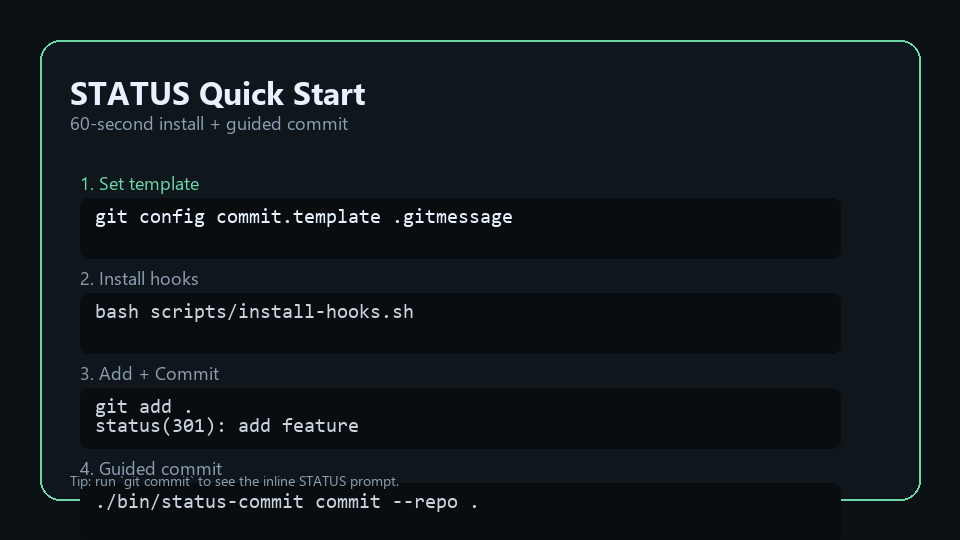

# STATUS Commit System
Readable git history, at a glance.

Created by Himeshchanchal Bhattarai
Inspired by HTTP status semantics.

License: Apache-2.0
Repository: https://github.com/Himesh-Bhattarai/STATUS_COMMIT

## What It Is
STATUS is a commit convention that encodes the reliability and state of a change.
It makes git history scannable, honest, and easy to communicate across teams.
The STATUS code signals the objective, intended state of the code (working, broken, refactored, WIP), while the message remains the author's narrative about what they did and why.

## Why STATUS
- You can scan a log and immediately see what is stable, risky, or in progress.
- It reduces bikeshedding by limiting the code to a small, consistent set.
- It makes risk explicit (e.g., `409` for risky, `500` for broken) so teams don't ship surprises.

Example:
```
status(301): add export endpoint
status(409): works but risky, needs extra testing
```

## Quickstart
1. Install the CLI globally  
   ```bash
   npm install -g status-commit
   ```
2. Install hooks + CI + templates in your repo  
   ```bash
   status-commit install --ci --templates
   ```
3. Make a commit  
   ```bash
   git commit -m "status(301): add export endpoint"
   ```

Tip: run `git commit` (without `-m`) to see the inline STATUS prompt in your editor (prepare hook reserved for future automation).

## Quick Start Video (GIF)
Below is a short, looping GIF showing the 60-second install and a guided commit (recorded with v1.3.0):



## Guided Commit (Uses -m)
If you want a guided menu that still uses `-m` under the hood:

```bash
# macOS / Linux
./bin/status-commit commit --repo /path/to/your-repo
```

```powershell
# Windows
powershell -ExecutionPolicy Bypass -File bin/status-commit.ps1 commit -Repo C:\path\to\your-repo
```

## VS Code Extension
Source is included in `vscode-extension/`. It provides autocomplete and a Quick Pick command.

## Format

```
status(###): short summary
```

Special case:

```
status(infinity): short summary
```

Accepted prefixes: `STATUS`, `Status`, `status` (recommended: `status`).
Required separator between code and summary: `:`.

## Cheat Sheet


Printable version:
[Printable Cheat Sheet (PNG)](assets/status-cheatsheet-printable.png)

Top codes:

| Code | When to use |
| --- | --- |
| STATUS(301) | New feature that works |
| STATUS(601) | Bug fix |
| STATUS(302) | Improvement to existing feature |
| STATUS(201) | Stable change |
| STATUS(300) | Refactor only |
| STATUS(102) | Work in progress |

## Decision Guide
- Use 1xx when the work is incomplete or experimental.
- Use 103 when the work is blocked or waiting on a dependency.
- Use 104 for research or spike work.
- Use 2xx when the change is working and safe.
- Use 3xx when you improved or refactored something.
- Use 5xx when something is broken or failing.
- Use 6xx when you fixed a failure.
- Use 203 for documentation-only changes.
- Use 409 when it works but is risky or fragile.
- Use 404 for human chaos or debugging madness.

Note: Some numeric gaps are intentional and reserved for future codes or team-specific use.

## Examples

```
status(301): add export endpoint
status(601): fix null pointer in auth middleware
status(102): scaffold payment flow
status(103): blocked by vendor API changes
status(409): works but risky, needs extra testing
status(203): update README and usage examples
status(infinity): v1.0.0 gold master
status(404): everything is broken except me
```

## Live Examples
- [STATUS Commit System (this repo) - commit history](https://github.com/Himesh-Bhattarai/STATUS_COMMIT/commits/main)

## Tooling
- `.gitmessage` commit template for consistent summaries.
- `hooks/commit-msg` validates the STATUS format.
- `hooks/prepare-commit-msg` pre-fills a STATUS line for empty messages.
- `scripts/install-hooks.*` installs the hook for your repo.
- `status-codes.json` provides machine-readable codes.
- `bin/status-commit` and `bin/status-commit.ps1` install tools into any repo.

## Automation
A GitHub Action checks commit messages on PRs and pushes to `main`.

## Compatibility
You can combine STATUS with Conventional Commits if you want:

```
status(301): feat(api) add export endpoint
```

## Website (Next.js)
A full website lives in `website/` as a Next.js app.

```bash
cd website
pnpm install
pnpm dev
```

Deploy: GitHub Pages via the workflow in `.github/workflows/website.yml` (set Pages source to **GitHub Actions**).

## FAQ
- **Do I have to use it for every commit?** Only if you enable the hook or CI check.
- **Does it replace semantic versioning?** No. It is about commit intent, not releases.
- **Can I combine this with Conventional Commits?** Yes, just add the conventional type after the STATUS prefix.
- **What about merge commits?** They are allowed and ignored by the hook and CI.

## Contributing
See the repository for `CONTRIBUTING.md` and `CHANGELOG.md`.

## License
Apache-2.0. See the repository for `LICENSE` and `NOTICE`.
